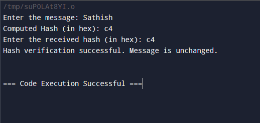

# Exp-14-Implement-Hash-Function
# AIM:
To generate a simple hash of a given message using a custom hash function.

# DESIGN STEPS:
Step 1:
Input a message from the user.

Step 2:
Use a basic custom hash function that applies simple operations like XOR and addition on the characters of the message.

Step 3:
Convert the resulting hash into a hexadecimal format.
Step 4:
Display the computed hash to the user.
Step 5:
Optionally verify the hash by recomputing it and comparing it with a received hash.

# PROGRAM:
```c
#include <stdio.h>
#include <string.h>
// Function to compute a simple hash using XOR and addition
void computeSimpleHash(const char *message, unsigned char *hash) {
    unsigned char temp = 0;
    // Simple hash computation: XOR and addition
    for (int i = 0; message[i] != '\0'; i++) {
        temp = temp ^ message[i];  // XOR each character
        temp += message[i];        // Add each character's value
    }
    // Store the result in the hash
    *hash = temp;
}

int main() {
    char message[256];      // Buffer for the input message
    unsigned char hash;     // Buffer for the hash (only 1 byte for simplicity)
    char receivedHash[3];   // Buffer for input of received hash (in hex format)

    // Step 1: Input the message
    printf("Enter the message: ");
    scanf("%s", message);

    // Step 2: Compute the simple hash
    computeSimpleHash(message, &hash);

    // Step 3: Display the computed hash in hexadecimal format
    printf("Computed Hash (in hex): %02x\n", hash);

    // Optional Step 5: Verify the hash
    printf("Enter the received hash (in hex): ");
    scanf("%s", receivedHash);

    // Convert received hash from hex string to an unsigned char
    unsigned int receivedHashValue;
    sscanf(receivedHash, "%02x", &receivedHashValue);

    // Compare the computed hash with the received hash
    if (hash == receivedHashValue) {
        printf("Hash verification successful. Message is unchanged.\n");
    } else {
        printf("Hash verification failed. Message has been altered.\n");
    }

    return 0;
}
```
# OUTPUT:



# RESULT:
The program for generating and verifying a simple hash of a given message using a custom hash function was executed successfully. The computed hash ensures basic integrity of the message.
